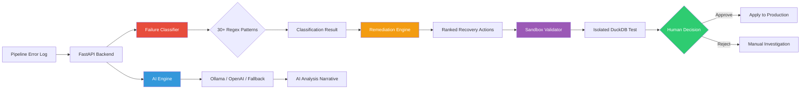
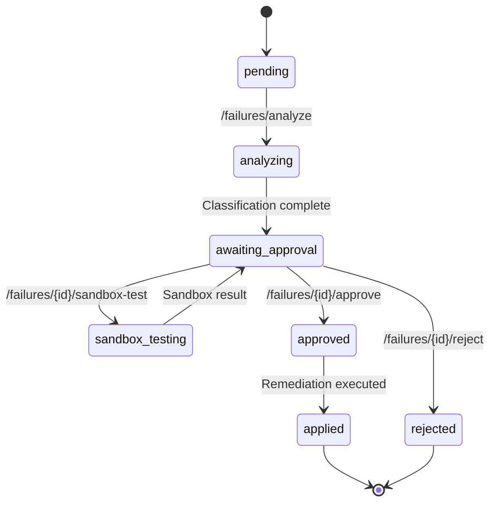

# 🛡️ Data Reliability Autopilot

**AI-Powered Pipeline Failure Classification, Remediation & Sandbox Validation**

[](https://github.com/jayachandra-poldasu/data-reliability-autopilot/actions)
[](https://www.python.org/downloads/)
[](LICENSE)

Data Reliability Autopilot is an intelligent SRE tool that **classifies data pipeline failures**, **proposes ranked remediation actions**, and **validates fixes in a DuckDB sandbox** — all with human-in-the-loop approval controls. It combines a **deterministic failure classifier** with **pluggable AI analysis** (Ollama/OpenAI) to model safe operational recovery for data workflows.

---

## ⚡ Quick Start

> **Runs without GPU, API keys, or Docker.** Just Python 3.11+.

### Step 1 — Clone & Setup (30 seconds)

```bash
git clone https://github.com/jayachandra-poldasu/data-reliability-autopilot.git
cd data-reliability-autopilot
python3 -m venv venv && source venv/bin/activate
pip install -r requirements.txt -r requirements-dev.txt
```

### Step 2 — Run Tests (show 133 tests passing, 97% coverage)

```bash
AUTOPILOT_AI_BACKEND=none pytest tests/ -v --tb=short --cov=app --cov-report=term-missing
```

**Expected output:**
```
tests/test_classifier.py    — 37 passed  (7 failure categories, 30+ patterns, edge cases)
tests/test_remediation.py   — 19 passed  (ranked proposals, SQL fix generation)
tests/test_sandbox.py       — 21 passed  (DuckDB sandbox, safety checks, validation)
tests/test_ai_engine.py     — 15 passed  (mocked LLM backends, fallback, health)
tests/test_api.py           — 22 passed  (all 6 API endpoints, workflow integration)
tests/test_models.py        — 19 passed  (Pydantic model validation, enums)
========================= 133 passed in ~2s =========================
TOTAL coverage: 97%
```

### Step 3 — Start API Server

```bash
AUTOPILOT_AI_BACKEND=none uvicorn app.main:app --reload
```

> Server starts at http://localhost:8000 — open http://localhost:8000/docs for Swagger UI

### Step 4 — Test the API (open a 2nd terminal)

**4a. Health Check:**
```bash
curl -s http://localhost:8000/health | python3 -m json.tool
```

**4b. List Pipelines:**
```bash
curl -s http://localhost:8000/pipelines | python3 -m json.tool
```

**4c. Analyze a Data Quality Failure (the key demo):**
```bash
curl -s -X POST http://localhost:8000/failures/analyze \
  -H "Content-Type: application/json" \
  -d '{
    "pipeline_name": "daily_order_ingestion",
    "error_message": "Could not convert string '\''invalid_number'\'' to INTEGER",
    "error_context": "Row 15 in batch 42, column amount",
    "pipeline_sql": "INSERT INTO orders SELECT id, name, CAST(amount AS INTEGER) FROM source_table"
  }' | python3 -m json.tool
```

**Expected: `"category": "data_quality"` with confidence ≥ 0.93, ranked remediations (quarantine → fix SQL → retry → skip), and deterministic analysis.**

**4d. Analyze a Schema Drift Failure:**
```bash
curl -s -X POST http://localhost:8000/failures/analyze \
  -H "Content-Type: application/json" \
  -d '{
    "pipeline_name": "revenue_aggregation",
    "error_message": "Column '\''revenue'\'' not found in table '\''daily_sales'\''"
  }' | python3 -m json.tool
```

**Expected: `"category": "schema_drift"` with schema migration as top remediation.**

### Step 5 — Launch Streamlit Dashboard (optional)

```bash
streamlit run ui.py
```

> Opens at http://localhost:8501 — use the **sample scenario buttons** for instant demo.

### Step 6 — Run Lint (zero errors)

```bash
ruff check app/ tests/
```

---

## 🎯 How It Works

1. Pipeline failure is reported via `/failures/analyze` with error message, context, and failing SQL
2. **Failure Classifier** runs 30+ regex patterns across 7 categories (schema drift, data quality, SQL error, timeout, dependency failure, resource exhaustion, permission error)
3. Each match has a confidence score; multiple matches in the same category boost confidence
4. **Remediation Engine** proposes 3-4 ranked recovery actions based on the failure category (retry, quarantine bad rows, rollback, apply schema migration, fix SQL, skip-and-alert)
5. For SQL-related fixes, the engine generates actual SQL: `TRY_CAST` for type issues, deduplication for duplicate keys, `COALESCE` for nulls
6. **Sandbox Validator** executes the proposed SQL in an isolated in-memory DuckDB instance with safety checks (blocked patterns: DROP DATABASE, ATTACH, COPY TO, etc.)
7. **Human-in-the-loop**: operator reviews results, can sandbox-test different remediation options, then approve or reject
8. State machine tracks the full lifecycle: `pending → analyzing → awaiting_approval → sandbox_testing → approved → applied / rejected / rolled_back`

### Why Deterministic-First?

The classifier is **deterministic** — same input always gives same classification and remediation proposals. AI is supplementary, not required. The tool works fully offline with `AI_BACKEND=none`. This matters for:
- **Reliability** — no API outages affect the failure classification
- **Auditability** — every classification is traceable to specific regex patterns with confidence scores
- **Speed** — classification runs in microseconds vs seconds for LLM calls
- **Safety** — sandbox SQL execution is isolated and safety-checked before human approval

---

## 🏗️ Architecture



### Workflow State Machine



---

## 🔑 Key Features

| Feature | Description |
|---------|-------------|
| **Failure Classification** | 30+ deterministic regex patterns across 7 categories with confidence scoring |
| **Ranked Remediations** | 3-4 prioritized recovery actions per failure type with risk levels |
| **SQL Fix Generation** | Auto-generated TRY_CAST, deduplication, COALESCE, and quarantine SQL |
| **Sandbox Validation** | Isolated DuckDB execution with safety guards and row limit checks |
| **Human-in-the-Loop** | Approve/reject workflow with full state machine tracking |
| **Pluggable AI Backend** | Works with Ollama, OpenAI, or fully offline (deterministic only) |
| **DuckDB Pipelines** | Simulated data pipelines with realistic quality issues |
| **Interactive Dashboard** | Streamlit UI with sample scenario buttons for instant demos |

---

## 🔍 Failure Categories

| Category | Patterns | Severity | Example Error |
|----------|----------|----------|---------------|
| Schema Drift | 5 patterns | High | `Column 'revenue' not found in table` |
| Data Quality | 7 patterns | Medium-High | `Could not convert string to INTEGER` |
| SQL Error | 5 patterns | High | `Syntax error at or near 'FORM'` |
| Timeout | 3 patterns | Medium-High | `Query timed out after 300 seconds` |
| Dependency Failure | 4 patterns | High | `Connection refused to database host` |
| Resource Exhaustion | 3 patterns | Critical | `Out of memory: cannot allocate 2GB` |
| Permission Error | 3 patterns | High | `Permission denied accessing table` |

---

## 💊 Remediation Actions

| Action | Used For | Risk Level |
|--------|----------|------------|
| **Retry** | Timeouts, transient failures, dependency recovery | Low |
| **Quarantine Bad Rows** | Nulls, type mismatches, duplicates | Low |
| **Fix SQL** | Type conversions (TRY_CAST), dedup, null handling | Medium |
| **Apply Schema Migration** | Missing columns, type changes | Medium |
| **Rollback** | Partial writes, corrupt state | High |
| **Skip and Alert** | Non-critical batches, manual investigation needed | Low |
| **Increase Resources** | OOM, disk full, CPU limits | Medium |
| **Fix Permissions** | Access denied, insufficient privileges | Medium |

---

## 📡 API Endpoints

| Method | Endpoint | Description |
|--------|----------|-------------|
| `POST` | `/failures/analyze` | Classify failure, propose remediations, generate AI analysis |
| `GET` | `/failures/{id}` | Get current state of a failure record |
| `POST` | `/failures/{id}/sandbox-test` | Run remediation SQL in isolated DuckDB sandbox |
| `POST` | `/failures/{id}/approve` | Approve and apply the selected remediation |
| `POST` | `/failures/{id}/reject` | Reject the proposed remediation |
| `GET` | `/pipelines` | List all registered data pipelines |
| `GET` | `/health` | Health check with AI backend status |
| `GET` | `/docs` | Interactive Swagger documentation |

### Example Response (`POST /failures/analyze`)

```json
{
  "id": "a1b2c3d4",
  "pipeline_name": "daily_order_ingestion",
  "state": "awaiting_approval",
  "classification": {
    "category": "data_quality",
    "confidence": 0.93,
    "reasoning": "Data quality issue — values violate constraints...",
    "matched_patterns": ["type_conversion_failure"]
  },
  "remediations": [
    {
      "rank": 1,
      "action": "quarantine_bad_rows",
      "description": "Isolate rows failing quality checks into a quarantine table.",
      "risk_level": "low",
      "auto_executable": true
    },
    {
      "rank": 2,
      "action": "fix_sql",
      "description": "Apply data cleansing SQL: TRY_CAST for types, COALESCE for nulls.",
      "sql_fix": "SELECT id, name, TRY_CAST(amount AS INTEGER) AS amount...",
      "risk_level": "medium"
    }
  ],
  "ai_analysis": "[Deterministic Analysis] Pipeline: daily_order_ingestion | Category: data_quality..."
}
```

---

## 🧪 Testing

```bash
# Run full test suite with coverage
AUTOPILOT_AI_BACKEND=none pytest tests/ -v --tb=short --cov=app --cov-report=term-missing

# Run specific test file
pytest tests/test_classifier.py -v

# Lint check
ruff check app/ tests/
```

| Test File | Tests | What's Tested |
|-----------|-------|---------------|
| `test_classifier.py` | 37 | All 7 categories (positive + negative), confidence scoring, multi-pattern boost, edge cases |
| `test_remediation.py` | 19 | Ranked proposals for all categories, SQL fix generation, quarantine SQL, schema migration |
| `test_sandbox.py` | 21 | DuckDB sandbox execution, SQL safety checks, custom data loading, row limits |
| `test_ai_engine.py` | 15 | Prompt construction, Ollama/OpenAI dispatch (mocked), fallback analysis, health checks |
| `test_api.py` | 22 | All 6 endpoints, validation (422), not found (404), full workflow integration |
| `test_models.py` | 19 | Pydantic validation, enum values, confidence bounds, default factories |
| **Total** | **133** | **97% code coverage** |

---

## 🗂️ Project Structure

```
data-reliability-autopilot/
├── app/
│   ├── __init__.py          # Package metadata & version
│   ├── main.py              # FastAPI app with 7 endpoints
│   ├── models.py            # Pydantic request/response schemas & state machine
│   ├── classifier.py        # 30+ deterministic failure classification patterns
│   ├── remediation.py       # Ranked remediation engine with SQL fix generation
│   ├── sandbox.py           # Isolated DuckDB sandbox validator with safety guards
│   ├── ai_engine.py         # Pluggable LLM integration (Ollama/OpenAI/fallback)
│   ├── config.py            # Settings via pydantic-settings & env vars
│   └── database.py          # DuckDB pipeline simulation & management
├── data/
│   └── raw_data.csv         # 20-row sample dataset with intentional quality issues
├── tests/
│   ├── conftest.py          # Shared fixtures (settings, client, sample data)
│   ├── test_classifier.py   # 37 tests
│   ├── test_remediation.py  # 19 tests
│   ├── test_sandbox.py      # 21 tests
│   ├── test_ai_engine.py    # 15 tests (mocked HTTP)
│   ├── test_api.py          # 22 integration tests (FastAPI TestClient)
│   └── test_models.py       # 19 validation tests
├── ui.py                    # Streamlit dashboard (3 tabs)
├── Dockerfile               # Multi-stage build, non-root, healthcheck
├── docker-compose.yml       # API + UI + Ollama (3 services)
├── Makefile                 # make test | make run | make lint
├── requirements.txt         # Production dependencies
├── requirements-dev.txt     # Test/dev dependencies (pytest, ruff)
├── .env.example             # All config options documented
└── .github/workflows/ci.yml # Lint → Test → Docker Build
```

---

## 🛠️ Tech Stack

| Category | Technologies |
|----------|-------------|
| **Backend** | Python, FastAPI, Pydantic, Uvicorn |
| **Database** | DuckDB (in-memory OLAP) |
| **AI/LLM** | Ollama (Llama 3), OpenAI API, Prompt Engineering |
| **Frontend** | Streamlit, Pandas |
| **Testing** | Pytest, pytest-cov, unittest.mock |
| **DevOps** | Docker, Docker Compose, GitHub Actions CI/CD |
| **Linting** | Ruff |

---

## 🐳 Docker Setup

```bash
# Full stack (API + UI + Ollama)
docker-compose up --build

# Access:
#   API:     http://localhost:8000
#   UI:      http://localhost:8501
#   Swagger: http://localhost:8000/docs
```

---

## 📄 License

This project is for educational and portfolio purposes.

---

Built by [Jayachandra Poldasu](https://www.linkedin.com/in/jayachandra-poldasu/) as a demonstration of AI-assisted data reliability engineering.